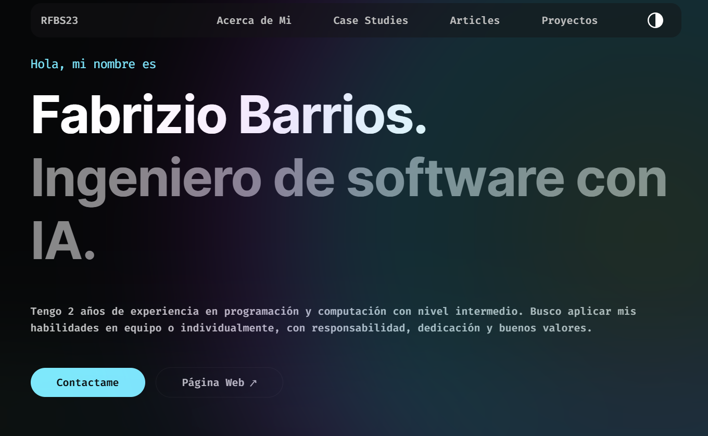
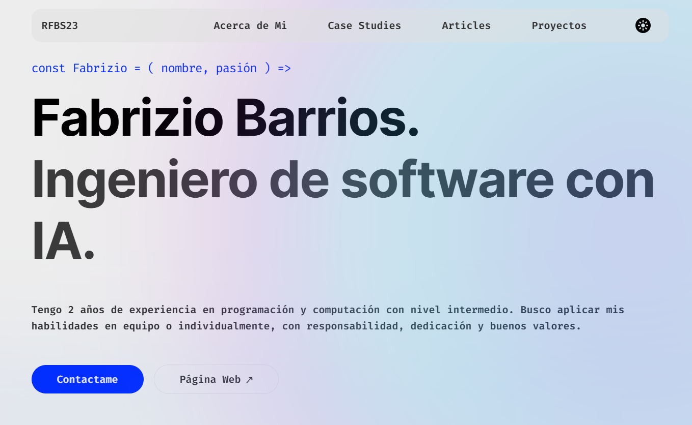
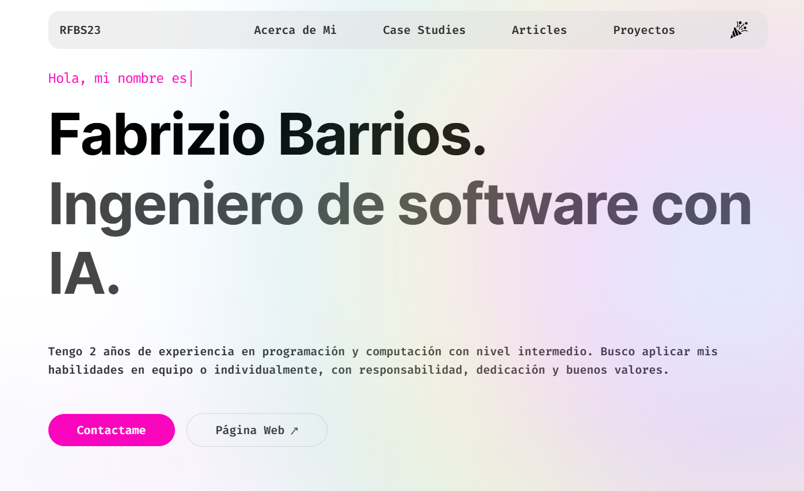

haz click para [`Ver portafolio`](https://portafolio-fabridev.vercel.app/).

## En Vercel
Este portafolio, que ha pasado de React a Next.js, está alojado en [Vercel (repositorio)](https://vercel.com/rfbs19s-projects/portafolio) con un nuevo diseño.
Vercel ofrece una forma sencilla de desplegar proyectos de Next.js. Puedes ver la versión en vivo del sitio utilizando el enlace anterior o haciendo clic aquí para visualizarlo: [`Ver portafolio`](https://portafolio-fabridev.vercel.app/).

## Capturas del nuevo diseño

| Negro | Blanco | Colorido |
|-------|--------|----------|
|  |  |  |

## Licencia

Este proyecto está bajo la licencia MIT. Consulta el archivo [LICENSE](LICENSE.txt) para más detalles.

## Contacto

Si tienes alguna pregunta o sugerencia, no dudes en contactarme a través de [fabriziobarrios92@gmail.com](mailto:fabriziobarrios92@gmail.com).

## Desarrollador

<h3><b>Portafolio Desarrollado por:</b> Fabrizio Barrios Saavedra (RFBS23 - FabriDev)</h3>

